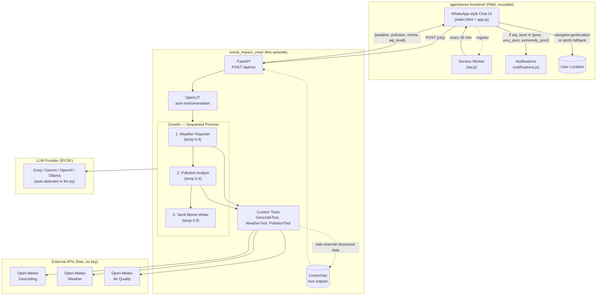

# Architecture — Social Impact Crew (AgentVerse Episode 1)



## Why this shape

- **PWA is its own folder** because the same frontend will be reused across AgentVerse episodes (CrewAI, LangGraph, Google ADK, etc.). Only the backend changes per episode — the frontend talks to a fixed REST contract.
- **API contract** is deliberately framework-agnostic: `POST /api/run {city}` → `{weather, pollution, meme, aqi_level}`. Any future episode just needs to expose the same shape.
- **Tool side-channel via `ContextVar`** captures structured data without polluting LLM-facing tool outputs. The agents still see human-readable strings; the API gets typed dicts.
- **OpenLIT one-liner** auto-instruments LLM + HTTP calls so the user can wire up any OTLP-compatible backend (Grafana, Jaeger, OpenLIT UI, etc.) by setting env vars.
- **Sequential process** preserved for the educational CLI demo. The API runs the same crew end-to-end.

## API contract (locked across episodes)

**Request:** `POST /api/run`
```json
{ "city": "Chennai" }
```

**Response:** `200 OK`
```json
{
  "city": "Chennai",
  "coords": { "lat": 13.087, "lon": 80.278, "country": "India" },
  "weather": {
    "temp_c": 29.9,
    "feels_like_c": 35.7,
    "humidity_pct": 81,
    "wind_kmh": 12.9,
    "precip_mm": 0.0
  },
  "pollution": {
    "european_aqi": 30,
    "pm2_5": 14.1,
    "pm10": 18.0,
    "no2": 10.5,
    "o3": 76.0,
    "co": 323.0
  },
  "aqi_level": "fair",
  "meme": "Dei thambi, Chennai la 29.9 degree thermostata nu solren..."
}
```

**`aqi_level` values** (European AQI bands, per EEA):
- `good` (0–20)
- `fair` (20–40)
- `moderate` (40–60)
- `poor` (60–80)
- `very_poor` (80–100)
- `extremely_poor` (>100) ← frontend fires push notification at this level
